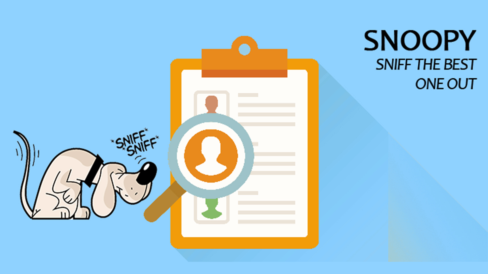

 

# Snoopy 
~Automate your application screening process 

Snoopy is an of the age software which acts as a human resource database for organizing applicants. It skips through the tedious process of screening through thousands of applications for a single job profile by automating the whole process. It uses a smart analysis feature to sift through a large batch of applicants, organizing them based on the required skills, serialize with respect to the required parameters and ultimately contact them directly by dropping an acceptance or rejection email/ text. It is a simple tool which makes the life of both the HR Manager/Recruiter and the applicant much easier. The interface allows the applicants to easily upload their resumes, which are then processed using NLP and analyzed (custom analysis is offered too). The analysis result, ranks the applicants suitable for the job and presents the top ones for the job profile, after which a mail is sent to all the selected ones at a click of a button.

## Features
* Applicants can apply for the job/event in seconds
* Companies/Organizers can view the databse of applicants using their logins
* Select the best applicants using the customized filter in seconds
* Send the selected applicants acceptance emails/text-messages right away  

## Why Snoopy?
Snoopy skips through the tedious application process of filling a huge form. It extracts all these details directly from the resume using NLP and from the GitHub profiles.  
At the recruiters side, it transforms the manual screening process into an automated ranking system using a heuristic based on the extracted data and the specific requirements.

## Contributors
- [@jcs98](https://github.com/jcs98)
- [@prachiti98  ](https://github.com/prachiti98)
- [@ABCF98 ](https://github.com/ABCF98)
- [@bhagwatmugdha](https://github.com/bhagwatmugdha)

This was our submission for the KJSCE Hackathon. It was made within 24 hours with minimal preparation.  
We were awarded 5th place out of the 55 participanting teams.
